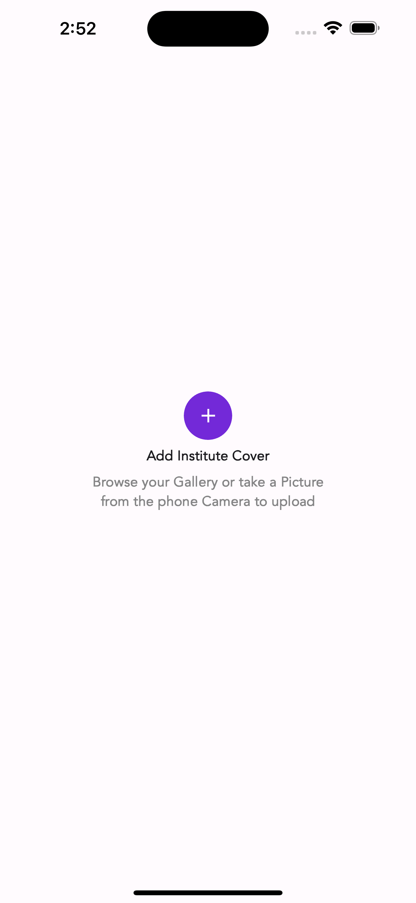
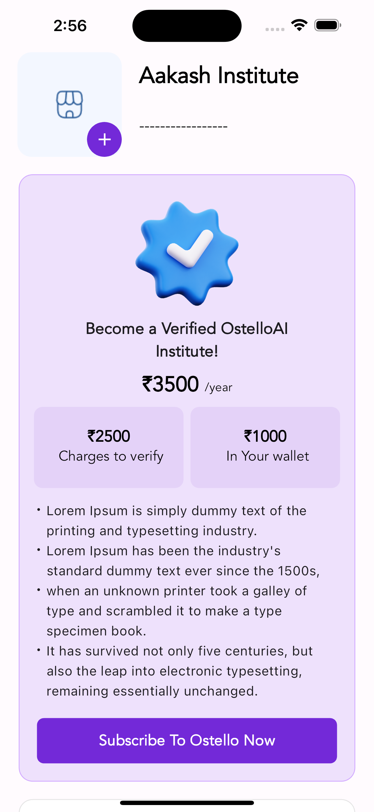
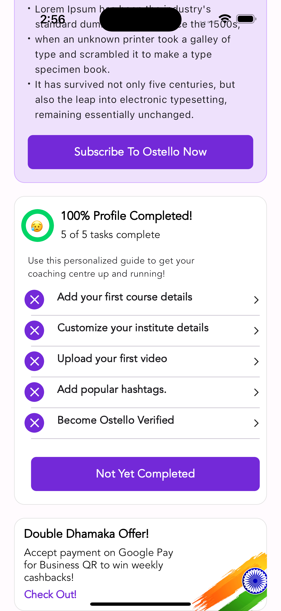
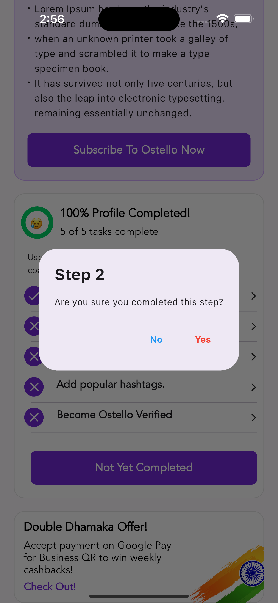
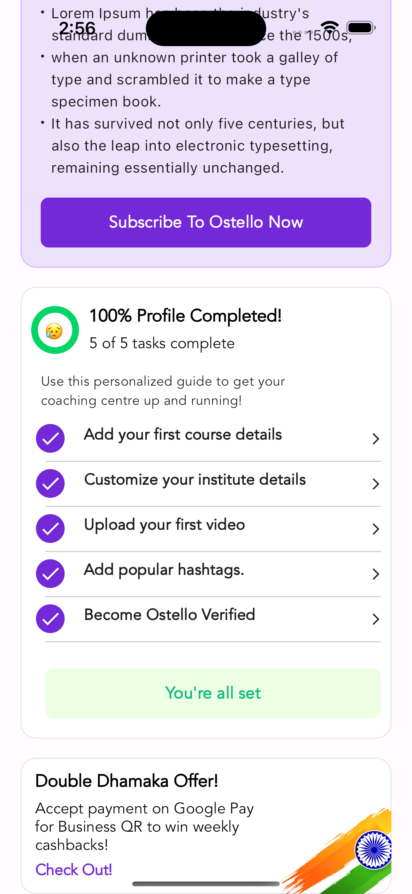

# Ostello_Assignment

First Screen:

The first screen contains a button and a label.
It also includes components:
Widgets: Various widgets are used, including bulleted_list, buttons, check_out, container, rich_text, and task, which are essential for the app's functionality and user interface.

Second Screen:
Widgets included in Screen 2: Bulleted_list, buttons, check_out, container, rich_text, and task.
Provider: Used to manage the state of completed and incomplete tasks.
The second screen is accessed by pressing the add button on the first screen.
Includes an AlertDialog box to ensure that all tasks are completed. When all tasks are completed, the AlertDialog box turns green.

Functionality:

The Provider is used to manage the state of completed and incomplete tasks across the app.
Navigator is used to navigate between screens. For example, when the checkout button is pressed, it routes back to the previous screen.
The bulleted_list widget is used to display a list of texts with bullets.
Buttons are used for various actions, such as pressing the checkout button to navigate to the previous screen.
The container widget is used for layout and styling purposes.
Rich_text is used to display formatted text with different styles.
The task widget represents a task item, which can be completed or incomplete based on user interaction.

# Screenshots of the Assignment

